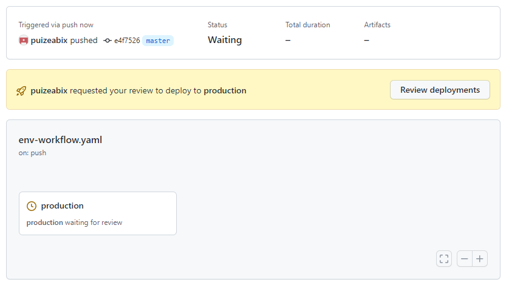

# pttgc-devops-lab05
This module will help attendees to have a better understanding to improvise and use environment variables in their DevOps workflows to reduce the duplicate effort.

In this lab, we will continue working on the topics that we left off in the previous lab which is an `Environment Secrets` and will also include the `Default variables` which can be used in the workflow

## Exercise 1 - Using Environment Secrets
The Environment Secrets usually being used in the `continuous delivery (CD)` phase, especially when we want to deploy software to various of environments, e.g. `dev`, `qa`, `staging`, `production`. We want to protect some of the environment, especially `production` environment. So some level of control have to be implemented. And `Environment Secrets` helps us to achieve that goal.

- Create new repository name `devops-lab05`, and copy everything except `.github/workflows` (we will create it later)
- Go to GitHub UI `Settings-->Environments`, then create environment; `production`


- Leave `Required reviewers` unselected
- Click `Add Secret` and input secret name `TOKEN` with value `aaa`
- Then we create our workflow in `.github/workflows` directory
```yaml
# Example
name: Environment variables workflow

on: 
  push:
    branches:
      - main
      - master
  workflow_dispatch:
    
jobs:
  production:
    runs-on: ubuntu-latest
    #this is how to tell GitHub Action workflow to use secrets from environment secret
    environment: production 
    env:
      TOKEN: ${{ secrets.TOKEN }}
    steps:
      - uses: actions/checkout@v3
      - name: validate
        run: python validate.py
```

- Commit and push the code, then go to GitHub UI to see how your workflow is running
- Check the output from `validate` steps to confirm that we are able to get secret from `production` environment


## Exercise 2 - Add approval process to Environment Secrets
With `Environment Secrets` we can implement approval process.

- Use same repository from `exercise 1` and go to `Settings-->Environments`
- Add protection rule, by select `Required reviewers`, then add your GitHub username as one of the approver


- Then go to `Actions` tab and manually trigger your workflows
- You should see the request for your review and approval


- Then click `Review deployments`, Select `production` and leave some comment *(optional)*, then click `Approve and deploy`


## Exercise 3 - Understand Secrets scope
This exercise will help you to understand the scope of the secrets of each types

- Use the same repository
- Create another environment; `dev`
- Create the secret with the same name as production, which is `TOKEN` but the value is `bbb`
- Then also create `Repository Secrets` with the same name; `TOKEN` but the value is `ccc`

- Update your existing workflow by adding another two jobs (`dev` and `repo`)
```yaml
  dev:
    runs-on: ubuntu-latest
    # This will tell GitHub Actions to use environment dev
    environment: dev
    env:
      TOKEN: ${{ secrets.TOKEN }}
    steps:
      - uses: actions/checkout@v3
      - name: validate
        run: python validate.py
  # Job name repo, run without specify the environment, it should get the secret from Repository Secret
  repo:
    runs-on: ubuntu-latest
    env:
      TOKEN: ${{ secrets.TOKEN }}
    steps:
      - uses: actions/checkout@v3
      - name: validate
        run: python validate.py
```
